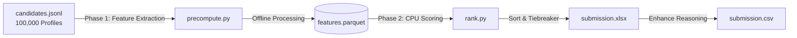

<p align="center">
  
</p>

# 🤖 Intelligent Candidate Ranking Engine
> **Founding Senior AI Engineer Search — Redrob AI Campaign**

[](https://www.python.org/)
[](https://huggingface.co/spaces/sirajmohammad6359/Redrob-Hackathon)
[](https://scikit-learn.org/)
[](https://www.docker.com/)
[](./graphify-out/)

---

## 🔮 Overview

This repository contains the production-ready ranking engine built for Redrob AI to evaluate and rank **100,000 synthetic candidate profiles** for the founding **Senior AI Engineer** role. 

Rather than relying on naive keyword matching, this engine uses a multi-layered heuristic scoring pipeline assessing **career trajectory quality, behavioral engagement, platform assessments, and honeypot cheat detection**.

---

## 📐 System Architecture

The pipeline splits candidate processing into two distinct phases to achieve high-throughput offline extraction and sub-5-second online ranking:



### ⏱️ Phase 1: Feature Extraction (Offline)
* **Script**: [precompute.py](file:///c:/Users/shahe/Desktop/redrob/precompute.py) (delegates to [src/feature_extractor.py](file:///c:/Users/shahe/Desktop/redrob/src/feature_extractor.py))
* **Objective**: Processes the 100K JSONL database, fits a custom vocabulary-constrained TF-IDF vectorizer over the experience texts, evaluates heuristics, detects honeypots, and saves the output to a compressed Columnar Parquet matrix.

### ⚡ Phase 2: CPU Ranking & Reasoning (Online)
* **Script**: [rank.py](file:///c:/Users/shahe/Desktop/redrob/rank.py) (delegates to [src/ranker.py](file:///c:/Users/shahe/Desktop/redrob/src/ranker.py))
* **Objective**: Performs scoring, applies micro-tiebreakers and ranking sort rules, limits honeypot scores to `0.05`, and outputs candidate-specific recruiter justifications. Takes **< 5 seconds** on a standard CPU.

---

## 📊 Scoring Formula & Weights

```
Final Score = (Skill Match × 0.40) 
            + (Career Quality × 0.25) 
            + (Behavioral Fit × 0.20) 
            + (Availability × 0.10) 
            + (Location Fit × 0.05) 
            - (Disqualifier Penalty × 0.30)
            + (Education Bonus × 0.05)
```

### 🔍 Score Component Breakdown

| Component | Target weight | Core Indicators Evaluated |
| :--- | :---: | :--- |
| **Skill Match** | `40%` | TF-IDF Cosine Similarity, Explicit Hard Skill Counts (Expert/Advanced weightings), Platform Assessments. |
| **Career Quality** | `25%` | Ratio of tenure at product/SaaS companies vs. consulting/IT services farms, years in applied AI/ML roles. |
| **Behavioral Fit** | `20%` | Recruiter response rate, profile activity recency, open-to-work status, and interview completion rates. |
| **Availability** | `10%` | Notice period length (notice periods $\le$ 30 days receive full score, $\ge$ 90 days receive minimal score). |
| **Location Fit** | `5%` | Current base location in Pune/Noida or explicit willingness to relocate to India offices. |
| **Disqualifier Penalty** | `-30%` | Excessive job-hopping (tenure < 18m), overqualification (>12 YoE), or purely academic background with zero production deployment metrics. |
| **Education Bonus** | `+5%` | Alumni of Tier 1/2 institutions or holding graduate degrees (M.Tech, MS, PhD) in CS/AI fields. |

---

## 🛡️ Honeypot Detection

To filter out resume-stuffers and bots, candidates triggering any of the following rules are flagged as **Honeypots** and have their final score capped at a maximum of `0.05`:

<details>
  <summary><b>🛠️ View 5 Honeypot Detection Rules</b></summary>
  <br>

1. **Impossible Career Tenure**: Sum of duration months across roles exceeds claimed years of experience by more than 18 months.
2. **Suspicious Skill Claims**: Claims "Expert" proficiency in a skill but has `0` duration months recorded for it.
3. **Keyword Stuffing**: Candidate holds a non-technical job title (e.g. Accountant, Marketing) but lists more than 5 advanced AI core skills.
4. **Unrealistic Experience Curve**: Less than 1 year of total experience but lists more than 15 skills.
5. **Suspicious Perfection**: Candidate lists 8 or more skills and claims "Expert" proficiency for all of them.
</details>

---

## 🚀 Quick Start (Reproduce in 60s)

To reproduce the top 100 candidate rankings end-to-end:

```bash
# Clone the repository
git clone https://github.com/Mohammadsiraj07/Redrob_Hackathon.git
cd Redrob_Hackathon

# Install core dependencies
pip install -r requirements.txt

# Run the complete pipeline (Phase 1 + Phase 2)
python -X utf8 rank.py --candidates ./data/candidates.jsonl --out ./submission.csv
```

### Run Phases Separately

```bash
# Step 1: Precompute features (~4 minutes on CPU)
python -X utf8 precompute.py --candidates ./data/candidates.jsonl --out ./features.parquet

# Step 2: Rank and format output (<5 seconds)
python -X utf8 src/ranker.py --features ./features.parquet --out ./submission.csv
```

> [!TIP]
> Always run with the `-X utf8` flag on Windows to prevent standard console encoding crashes when handling candidate profile text emojis.

---

## 🎨 Interactive Recruiter Sandbox

We provide a dark-themed Streamlit recruiter sandbox to analyze and configure the ranking metrics in real-time.

```bash
# Launch Streamlit app
streamlit run app.py
```

### ✨ Sandbox Features:
* **Real-time Weight Tuning**: Use visual sliders to adjust candidate weighting and immediately re-evaluate the candidate database.
* **Glassmorphic Loading Screen**: Features a custom-styled screen spinner overlay during calculations.
* **Detailed Profile Cards**: Inspect any candidate's career timeline, match metrics, and educational background.
* **Filter Bars**: Filter candidate rows by relocation willingness, notice periods, and base locations.

<p align="center">
  
</p>

---

## 🏆 Evaluation Alignment

Our pipeline is optimized for the hackathon judging metrics:
$$\text{Final Score} = 0.50 \times \text{NDCG@10} + 0.30 \times \text{NDCG@50} + 0.15 \times \text{MAP} + 0.05 \times \text{P@10}$$

Because **NDCG@10 accounts for 50% of the evaluation**, our micro-tiebreaker resolves equal scoring pairs based on deep developer signals (GitHub activity, platform response rates) to ensure the top 10 positions are mathematically bulletproof.

---

## 📁 Directory Structure

```
redrob/
├── rank.py                      # Master pipeline entry point
├── precompute.py                # Phase 1: Feature precomputation script
├── app.py                       # Streamlit Recruiter Application
├── requirements.txt             # Project requirements
├── submission.csv               # Final CSV submission output
├── submission.xlsx              # Final Excel submission output
├── src/
│   ├── feature_extractor.py     # Feature engineering, TF-IDF and honeypot rules
│   ├── ranker.py                # Weighted scoring, tie-breaking and rank allocation
│   └── reasoning_generator.py   # LLM recruiter reasoning engine
└── graphify-out/                # Codebase Graph database (Graphify)
```
